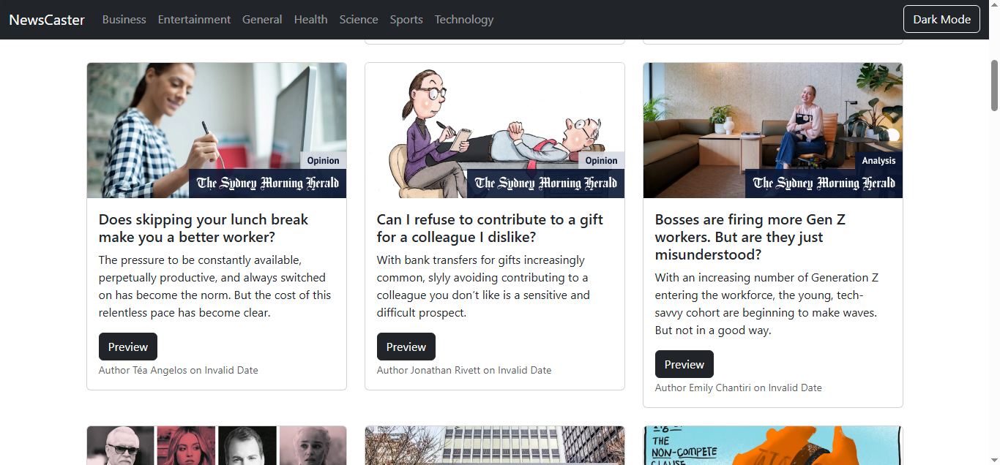

# 📱 **NewsCaster - A News Aggregator App**

Welcome to **NewsCaster**! 🌍 A fully responsive, AI-powered news aggregator app built using **React**. Stay updated with the latest news from various categories such as **Business**, **Entertainment**, **General**, **Health**, **Science**, **Sports**, and **Technology**. The app is designed with a **dark mode** for better readability during night time.

## 📖 **Features:**
- **Categories**: Get news from a wide range of categories, including:
  - **Business**
  - **Entertainment**
  - **General**
  - **Health**
  - **Science**
  - **Sports**
  - **Technology**

- **Dark Mode**: Toggle between **dark** and **light** modes to suit your preference.
- **Responsive Design**: The app works seamlessly on **mobile**, **tablet**, and **desktop** devices.
- **News Articles**: View **real-time news articles** with headlines, descriptions, and links to full stories.
- **Search Functionality**: Easily search for news by category or specific keywords.

## 🛠 **Tech Stack:**
- **React**: Core frontend framework for building interactive UI.
- **CSS**: Styling and layout for the app.
- **React Context API**: For state management across the app.
- **News API**: Fetch real-time news articles.
- **Local Storage**: Store the user's **dark mode** preferences.

## 📸 **Screenshots:**

Here's a sneak peek of the **NewsCaster** app in action:

  
*(Example of how the NewsCaster app looks)*

## 🌍 **Live Demo:**
Check out the live version of the app [here](https://ahsanlaeeq.github.io/Newscaster_app/).  
Experience the latest news from multiple categories right in your browser!

---

## 🛠 **Installation & Setup:**

1. **Clone the repository**:

    ```bash
    git clone https://github.com/AhsanLaeeq/NewsCaster.git
    cd NewsCaster
    ```

2. **Install the required dependencies**:

    ```bash
    npm install
    ```

3. **Run the development server**:

    ```bash
    npm start
    ```

4. **Open the app** in your browser at `http://localhost:3000`.

---

## 📝 **How to Use:**
- Open the app in your browser.
- Choose a category (Business, Sports, Health, etc.) to read the latest news.
- Switch between **light** and **dark** modes as per your preference.
- Click on any news article to read more.

---

## 📄 **License:**
This project is licensed under the **MIT License** - see the [LICENSE](LICENSE) file for details.

---

## 💬 **Feedback & Contributing:**

If you have any suggestions or would like to contribute to the project, feel free to:

- **Fork** the repository.
- **Submit a pull request**.

For any feedback, please open an issue or contact me directly:

- **LinkedIn**: [Ahsan Laeeq](https://www.linkedin.com/public-profile/settings?trk=d_flagship3_profile_self_view_public_profile))

---

## 👨‍💻 **Created by AhsanLaeeq**

- **Connect with me** on [LinkedIn](https://www.linkedin.com/public-profile/settings?trk=d_flagship3_profile_self_view_public_profile).
- **GitHub**: [Ahsan Laeeq](https://github.com/AhsanLaeeq)

---

🌟 **Enjoy reading the news and stay informed!**
